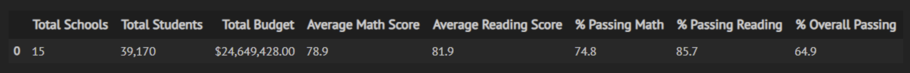

# School_District_Analysis
## Overview of the school district analysis
This project analyzes data from various sources and a variety of formats from a city school district. Our analysis will prepare all standardized test data for analysis, reporting, and presentation to provide insights about performance trends and patterns. These insights will form inputs to discussions and strategic decisions at the school and district level about the school budget and priorities and students' standardized test scores.

Further to our analysis, we are investigating the evidence of academic dishonesty in the student's data provide in the students_complete.csv file; specifically, reading and math scores for Thomas High School ninth-graders appear to have been altered. Although the school board does not know the full extent of academic dishonesty, they want to uphold state-testing standards. Thus, our analysis will replace the math and reading scores for Thomas High School with NaNs while keeping the rest of the data intact. We would then repeat the school district analysis and show how the changes affected the overall analysis.

At the end of our analysis, we will be able to provide insights on the following questions:
  - How is the district summary affected?
  - How is the school summary affected?
  - How does replacing the ninth graders' math and reading scores affect Thomas High School's performance relative to the other schools?

How does replacing the ninth-grade scores affect the following:
  - Math and reading scores by grade
  - Scores by school spending
  - Scores by school size
  - Scores by school type

## Results

By replacing 9th grade math and reading scores for Thomas High School with NaN, the results of our analysis changed the following results:

- District Summary: % Passing Math, % Passing Reading, and % Overall Passing changed by less than 0.2%; dropping from 75.0%, 86.0%, and 65.2% to 74.8%, 85.7%, and 64.9% respectively. While Average Math Score dropped by 0.1% from 79.0% to 78.9%, Average Reading remained unchanged at 81.9%.

District Summary including 9th Grade Thomas High School

District Summary excluding 9th Grade Thomas High School

- School Summary: % Passing Math, % Passing Reading, and % Overall Passing changed by more than 25.0%; dropping from 93.3%, 97.3%, and 90.9% to 66.9%, 69.7% and 65.1% respectively. Average Math Score and Average Reading Score remained largely unchanged.

School Summary including 9th Grade Thomas High School

School Summary excluding 9th Grade Thomas High School

- Top and Bottom Performing Schools: While Thomas High School's % Passing Math, % Passing Reading, and % Overall Passing dropped by 0.09%, 0.29%, and 0.32% respectively, the school still retained its second position in the top performing schools list. This is due to the fact that we recomputed the math and scores for only grade 10 to grade 12 excluding the grade 9 entirely. The list of bottom performing schools remain unchanged.

Top Performing Schools including 9th Grade Thomas High School

Top Performing Schools excluding 9th Grade Thomas High School

Bottom Performing Schools including 9th Grade Thomas High School

Bottom Performing Schools excluding 9th Grade Thomas High School

- Math and Reading Scores by Grade: By replacing 9th grade math and reading scores for Thomas High School, the 9th grade math and reading display NaN. All other entries for the other schools display the same scores before and after replacing 9th grade Thomas High School scores with NaN.

Math and Reading Scores by Grade including 9th Grade Thomas High School

Math and Reading Scores by Grade excluding 9th Grade Thomas High School

- Scores by School Spending: Since the recomputed Average Math Score and Average Reading Score, and % Passing Math, % Passing Reading, and % Overall Passing for Thomas High School were similar to results obtained originally, Scores by school spending remain unchanged across all metrics.

Scores by School Spending including 9th Grade Thomas High School

Scores by School Spending including 9th Grade Thomas High School

- Scores by School Size: Since the recomputed Average Math Score and Average Reading Score, and % Passing Math, % Passing Reading, and % Overall Passing for Thomas High School were largely unchanged, Scores by school size remain unchanged across all metrics.

Scores by School Size including 9th Grade Thomas High School

Scores by School Size excluding 9th Grade Thomas High School

- Scores by School Type: Since the recomputed Average Math Score and Average Reading Score, and % Passing Math, % Passing Reading, and % Overall Passing for Thomas High School were largely unchanged, Scores by school type remain unchanged across all metrics.

Scores by School Type including 9th Grade Thomas High School

Scores by School Type excluding 9th Grade Thomas High School

## Summary
By replacing Thomas High School's Math and Reading scores resulted in changes in four of the seven metrics we measured for our School District Analysis.
1. Disrict Summary: % Passing Math, % Passing Reading, and % Overall Passing changed by less than 0.2%; dropping from 75.0%, 86.0%, and 65.2% to 74.8%, 85.7%, and 64.9% respectively. While Average Math Score dropped by 0.1% from 79.0% to 78.9%, Average Reading remained unchanged at 81.9%.
2. School Summary: % Passing Math, % Passing Reading, and % Overall Passing changed by more than 25.0%; dropping from 93.3%, 97.3%, and 90.9% to 66.9%, 69.7% and 65.1% respectively. Average Math Score and Average Reading Score remained largely unchanged.
3. Top and Bottom Performing Schools: While Thomas High School's % Passing Math, % Passing Reading, and % Overall Passing dropped by 0.09%, 0.29%, and 0.32%, respectively, the school still retained its second position in the top-performing schools' list. This result is because we recomputed the math and scores for only grade 10 to grade 12, excluding grade 9 scores entirely for Thomas High School. The list of bottom-performing schools remains unchanged.
4. Math and Reading Scores by Grade: By replacing 9th-grade math and reading scores for Thomas High School, the 9th-grade math and reading display NaN. All other schools' entries display identical scores before and after replacing 9th grade Thomas High School scores with NaN.

It is worth noting that by replacing with NaNs, Pandas mean() method ignored all records with NaN and focused only on numbers; thus, our average calculations remained essentially unchanged. Also, Thomas High School's 9th Grade average reading score is identical to the population average (THS: 83.73, District: 81.88). Similarly, the average math score was off the population mean by a few points (THS: 83.59, District: 78.99). Thus, replacing 9th-grade scores with NaN for Thomas High School did not change the district averages by wide margins.

Without accounting for the students with NaNs, the School Summary saw % Passing Math, % Passing Reading, and % Overall Passing drop by more than 25.0%, respectively. We, however, noticed that when we recomputed % Passing Math, % Passing Reading, and % Overall Passing using data for grade 10 to grade 12, Thomas High School numbers went back to approximately initial values.
